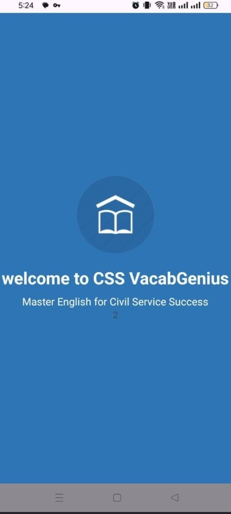
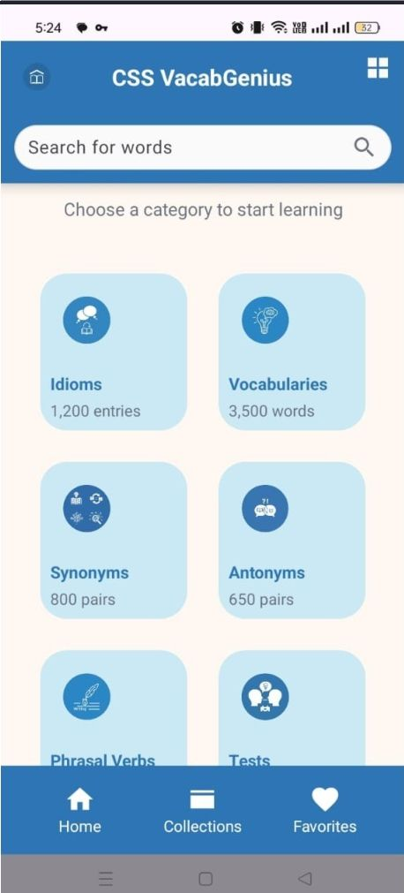
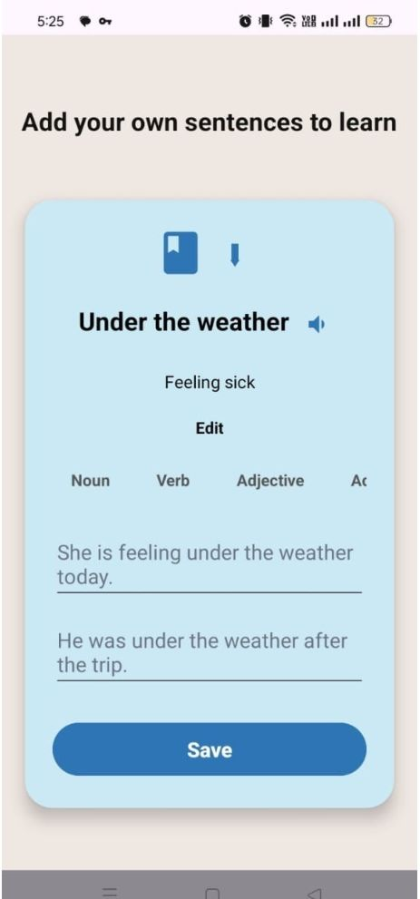
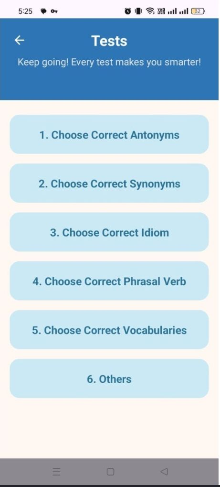
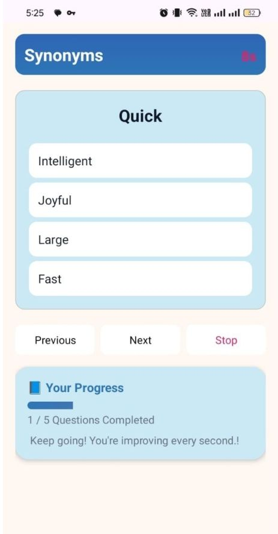
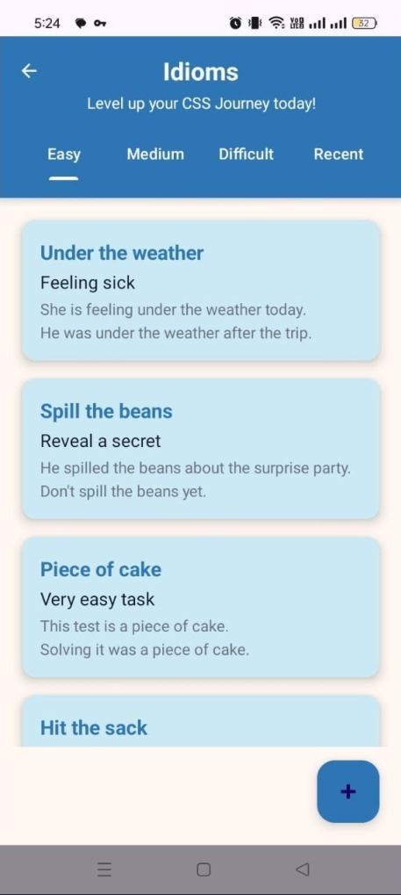

# VocubGenius-780
This app solves the problem of scattered and unorganized preparation resources for competitive exams like CSS and PMS by bringing vocabulary topics such as synonyms, antonyms, idioms, and phrasal verbs into one structured platform. It helps students save time , study more efficiently by providing all essential English test material in a single app.
## Screenshots

The following screenshots provide a quick overview of the application's interface and some functionalities.

### Welcome Screen

### Home Screen

### Edit By User

### Test Screen

### Timed Test

### Words by Order

